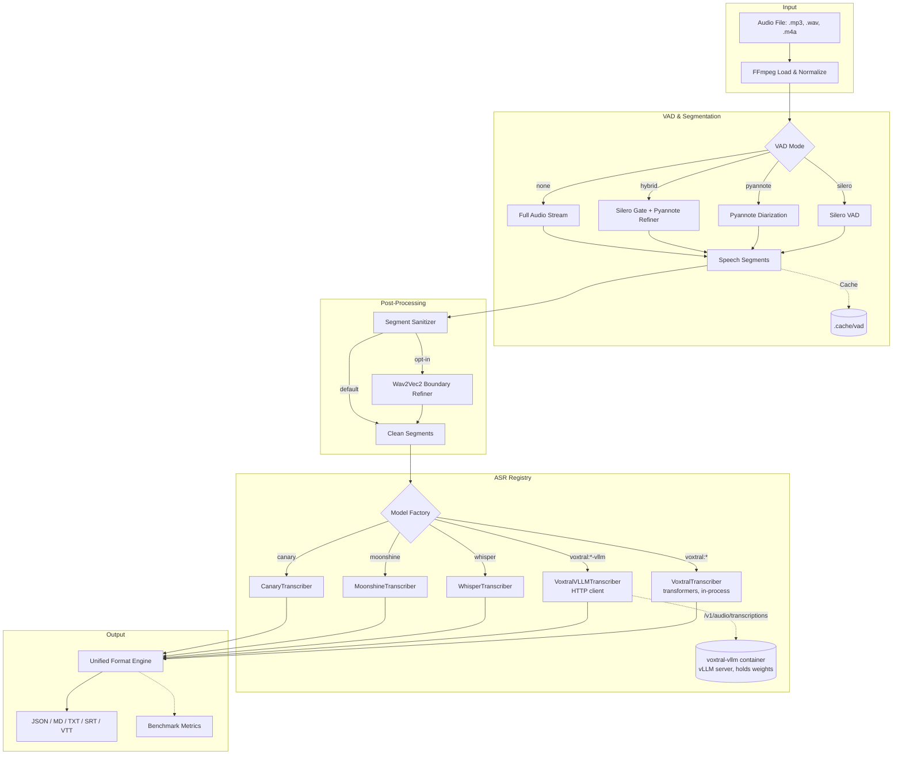

# VoxHub

**Multi-model transcription platform with an OpenAI-compatible API.** Run Voxtral, Whisper, Granite Speech, Moonshine, and Canary side-by-side — with advanced VAD, speaker diarization, and optional benchmarking. Optimized for NVIDIA Blackwell (GB10/GX10), CUDA, ROCm, and CPU.

---

## What VoxHub Does

VoxHub is an API-first transcription platform that lets you swap ASR backends without changing your client code. It exposes an OpenAI-compatible `/v1/audio/transcriptions` endpoint, so any client that works with the OpenAI Audio API (OpenHiNotes, TypingMind, etc.) works with VoxHub out of the box.

Under the hood, VoxHub orchestrates multiple transcription engines through a unified pipeline: audio loading, VAD segmentation, model inference, segment merging, and multi-format output — all configurable per request.

---

## Quick Start

### Docker (Recommended)

```bash
# Build the image
docker compose build voxhub-api

# Start the API server on port 8000
docker compose up voxhub-api
```

### Manual

```bash
pip install -r requirements.txt
# Create a .env file with your HF_TOKEN (see .env.example)
python server.py
```

### Test It

```bash
curl -X POST http://localhost:8000/v1/audio/transcriptions \
  -F file=@audio/meeting.mp3 \
  -F model=whisper:turbo \
  -F response_format=verbose_json
```

### Cross-project networking

The `voxhub-api` service is **not** published on a host port. It is reachable
only over a private Docker bridge network named `hinotes-internal`, owned by
the OpenHiNotes compose project. This keeps the API off the LAN — Caddy and
other proxy networks cannot see it.

VoxHub joins `hinotes-internal` as `external`, so the network must already
exist when VoxHub starts. Normally the OpenHiNotes stack creates it on its
own `docker compose up`. If you want to bring VoxHub up first, create it
manually (no-op if it already exists):

```bash
docker network create hinotes-internal 2>/dev/null || true
```

On the OpenHiNotes side, the **backend** service must also be on
`hinotes-internal` (the frontend doesn't need to be):

```yaml
services:
  backend:
    networks:
      - hinotes-internal     # already there for backend ↔ frontend / db
    environment:
      - VOXHUB_URL=http://voxhub-api:8000

networks:
  hinotes-internal:
    name: hinotes-internal
    driver: bridge           # owned by OpenHiNotes — declared without external:
```

After changing the OpenHiNotes backend's networks list, recreate it so the
new attachment takes effect (a plain `restart` won't pick up network
changes):

```bash
docker compose up -d --force-recreate backend
```

Verify resolution from inside the OpenHiNotes backend:

```bash
docker compose exec backend getent hosts voxhub-api
docker compose exec backend wget -qO- http://voxhub-api:8000/v1/models
```

> **Why not `proxy-net`?** `proxy-net` is the network Caddy uses to expose
> services to the LAN. Putting `voxhub-api` there would make it reachable —
> directly or via Caddy — from outside the host. `hinotes-internal` is a
> private bridge that nothing on the LAN can route to.

---

## Supported Models

| Family | Specifier | Backend | Key Strength |
| :--- | :--- | :--- | :--- |
| **Voxtral** | `voxtral:mini-3b`, `voxtral:small-24b` | Transformers | Beats Whisper large-v3 on FLEURS/Common Voice, HQ French/English |
| **Voxtral (vLLM)** | `voxtral:mini-3b-vllm`, `voxtral:small-24b-vllm` | vLLM (remote) | 3-10x throughput under load, paged attention |
| **Whisper** | `whisper:large-v3`, `whisper:turbo`, `whisper:small` | Transformers | Global benchmark leader, extreme throughput |
| **Granite Speech** | `granite:1b-speech` | Transformers | IBM multilingual (en/fr/de/es/pt/ja), edge-friendly 1B |
| **Moonshine** | `moonshine:base`, `moonshine:tiny` | Transformers | Ultra-low latency, CPU-efficient |
| **Canary** | `canary:1b` | NeMo | SOTA accuracy, multi-task (ASR/translation) |

Models are defined in `models.yaml` and loaded lazily on first request.

> **Granite Speech note:** the model bundles a LoRA adapter that transformers
> enables during inference, so `peft` is required (already listed in
> `requirements.txt`). Transcription is driven by a chat template — VoxHub
> wraps the audio with `<|audio|>` plus a per-language instruction
> automatically; no extra configuration is needed.

### Voxtral: Transformers vs vLLM

Voxtral can be served two ways, side by side. Both backends are wired into the
same `/v1/audio/transcriptions` endpoint and differ only in the model
specifier you pass.

| | `voxtral:mini-3b` (Transformers) | `voxtral:mini-3b-vllm` (vLLM) |
| :--- | :--- | :--- |
| Process | In-process with VoxHub | Separate `voxtral-vllm` container |
| Memory footprint on VoxHub | Model loaded lazily in VoxHub GPU | Zero — VoxHub holds only an HTTP client |
| Throughput under load | Good | 3-10x higher (paged attention + continuous batching) |
| Extra infra | None | One extra compose service |
| Cold start | ~10-20 s on first request | ~60-120 s when the vllm service starts |
| Good for | Dev, low-volume, edge boxes | Production, concurrent users |

**Key point on memory:** enabling a Voxtral model in `models.yaml` does *not*
load it eagerly. Models load lazily on first request. For the vLLM variant,
the VoxHub API container stays light regardless — the weights live in the
`voxtral-vllm` container, which *does* hold them in GPU memory for its
lifetime. If you don't start the vllm profile, that cost is zero.

#### Enabling the vLLM backend

```bash
# Start VoxHub together with the vLLM server
docker compose --profile vllm up -d voxhub-api voxtral-vllm

# Or just the vLLM server (if VoxHub runs elsewhere)
docker compose --profile vllm up -d voxtral-vllm

# Use it by requesting the *-vllm model key:
curl -X POST http://localhost:8000/v1/audio/transcriptions \
  -F file=@audio/meeting.mp3 \
  -F model=voxtral:mini-3b-vllm
```

If the vllm service isn't running when a `-vllm` model is requested, VoxHub
fails fast with a message telling you which compose command to run.

#### Using a custom vLLM image

The `voxtral-vllm` service defaults to `vllm/vllm-openai:latest`, which works
on stock CUDA GPUs (Ampere / Ada / Hopper) and ROCm. On hardware that isn't
covered by upstream wheels — most notably **NVIDIA Spark / GB10 (Blackwell
sm_120)** — you'll need to build vLLM yourself against a matching CUDA base
(e.g. `nvcr.io/nvidia/pytorch:26.03-py3`) and point VoxHub at your image:

```bash
# In .env (or shell env before `docker compose up`)
VOXTRAL_VLLM_IMAGE=my-registry/vllm-spark:0.19.1
```

Two gotchas when swapping the image:

1. **Entrypoint.** The `command:` list in `docker-compose.yaml` assumes the
   upstream entrypoint (`vllm serve ...`). If your custom image ships a
   different entrypoint (e.g. bare `python` or a shell), the args will land
   in the wrong place. Either set `ENTRYPOINT ["vllm", "serve"]` in your
   Dockerfile, or override it in the compose service:

   ```yaml
   voxtral-vllm:
     entrypoint: ["vllm", "serve"]
     command:
       - "--model"
       - "${VOXTRAL_VLLM_MODEL_ID:-mistralai/Voxtral-Mini-3B-2507}"
       # … rest as-is
   ```

2. **`mistral-common[soundfile]`.** Voxtral's startup profiling instantiates
   a dummy `Audio` object, which imports `soundfile`. The upstream vLLM
   image includes it; custom builds frequently don't, and the engine dies
   with:

   ```text
   ImportError: `soundfile` is not installed.
   Please install it with `pip install mistral-common[soundfile]`
   ```

   Fix by adding `libsndfile1` (system) and `mistral-common[soundfile]`
   (pip) to your Dockerfile:

   ```dockerfile
   RUN apt-get update && apt-get install -y libsndfile1 && rm -rf /var/lib/apt/lists/*
   RUN pip install --no-cache-dir 'mistral-common[soundfile]'
   ```

#### Attention backend (Flash Attention 2)

The transformers-based `voxtral:*` backend now defaults to
`attn_implementation="flash_attention_2"` on Ampere/Ada/Hopper CUDA GPUs
(sm_80/86/89/90) — typically ~1.5-2x faster than SDPA on Voxtral. The
defaults resolve as follows:

- **Blackwell (sm_120/sm_121, GB10/B200 consumer)** → `eager`. SDPA's
  sliding-window kernel still crashes with `cudaErrorNotPermitted` on
  current torch builds, and upstream Dao-AILab/flash-attention does not
  ship official wheels for sm_120+ (only community builds).
- **CUDA (Ampere/Ada/Hopper)** → `flash_attention_2`, with a transparent
  fallback to `eager` + a log hint if the `flash-attn` wheel is missing.
- **ROCm / CPU** → `sdpa`.

To install `flash-attn` in a CUDA image for the speedup:

```bash
pip install flash-attn --no-build-isolation
```

Or override the resolution explicitly in `models.yaml`:

```yaml
voxtral:mini-3b:
  args:
    attn_implementation: sdpa          # or "eager", "flash_attention_2"
```

### Automatic Language Detection

Backends that need an explicit language hint (Granite Speech, Canary
multilingual mode, etc.) get one automatically: when a request omits
`language` (or passes `auto`), VoxHub probes the first 30 seconds of audio
with **whisper-tiny** and forwards the detected ISO-639-1 code to the active
backend. **Whisper and Voxtral backends are skipped** — both detect language
natively and re-running detection would only add latency.

The probe model is small (~75 MB), loads in about a second on first use, and
adds well under a second of latency per job. Tune via env vars:

```bash
# Disable auto-detect entirely (clients must pass language= themselves)
VOXHUB_AUTO_DETECT_LANGUAGE=false

# Use a larger probe model if you need more accuracy on noisy audio
VOXHUB_LANG_DETECT_MODEL=openai/whisper-base
```

You can still force a language per request to skip detection:

```bash
curl -X POST http://localhost:8000/v1/audio/transcriptions \
  -F file=@audio/meeting.mp3 \
  -F model=granite:1b-speech \
  -F language=fr
```

---

## VAD & Diarization

VoxHub supports four VAD strategies, selectable per request or via config:

| Mode | Description | Best For |
| :--- | :--- | :--- |
| `silero` | Fast, lightweight Silero VAD | Speed-first workflows |
| `pyannote` | High-accuracy Pyannote segmentation + speaker diarization | Production quality |
| `hybrid` | Silero gate + Pyannote refiner with confidence-based safety net | Best recall + precision |
| `none` | No segmentation — process entire audio as one segment | Pre-segmented audio |

### Hybrid Mode (Refined Gating)

The hybrid pipeline uses Silero as a sensitive gate (threshold `0.35`) to capture all potential speech, then passes the audio to Pyannote for fine-grained segmentation and speaker labeling. A safety-net override keeps high-confidence Silero segments (probability > `0.8`) even if Pyannote disagrees.

```bash
# CLI
python main.py audio/meeting.mp3 --vad hybrid --diarize

# Tune the thresholds
python main.py audio/meeting.mp3 --vad hybrid --silero-threshold 0.3 --override-threshold 0.85
```

### Segment Post-Processing

After diarization, segments go through two optional post-processing layers before transcription. This fixes the common issue where Pyannote splits a speaker's turn at a short interjection (e.g. "ok", "yeah", "better"), producing mis-aligned timestamps.

**Layer 1 — Segment Sanitizer** (on by default)

Rule-based, no ML overhead. Handles two issues:

1. **Micro-turn absorption**: When speaker A is interrupted by a very short speaker B turn (< `--min-turn` seconds) and speaker A resumes immediately after, the two A segments are merged into one continuous turn. The interjection is dropped — its audio falls within the merged range and is captured by the ASR model.
2. **Overlap resolution**: When two segments overlap in time, the shorter one is trimmed so the timeline is strictly sequential.

```bash
# Default: absorb turns shorter than 1.5s
python main.py audio/meeting.mp3 --vad pyannote --diarize

# More aggressive: absorb turns shorter than 2.5s
python main.py audio/meeting.mp3 --vad pyannote --diarize --min-turn 2.5

# Disable sanitization entirely
python main.py audio/meeting.mp3 --vad pyannote --diarize --no-sanitize
```

**Layer 2 — Wav2Vec2 Boundary Refinement** (opt-in via `--refine-boundaries`)

Uses wav2vec2's CTC frame-level probabilities to snap each segment boundary to the exact speech onset/offset. For each boundary, a ±1s audio window is analyzed to find where speech actually starts and ends at the frame level. Useful when Pyannote's boundary is off by a few hundred milliseconds — enough to clip the first or last word.

```bash
python main.py audio/meeting.mp3 --vad hybrid --diarize --refine-boundaries
```

---

## API Reference

### Transcription (Synchronous)

`POST /v1/audio/transcriptions` — OpenAI-compatible. Supports `json`, `verbose_json`, `text`, `srt`, `vtt` formats.

### Transcription (Async Jobs)

For long audio files, use the Jobs API:

1. `POST /v1/audio/transcriptions/jobs` — Submit a job. Returns `job_id` and status/result links.
2. `GET /v1/audio/transcriptions/jobs/{job_id}` — Poll status. Returns `status` (`pending`, `processing`, `completed`, `failed`), `stage` (`loading`, `vad`, `transcribing`, or `null` when done), and `progress` (0-100%).
3. `GET /v1/audio/transcriptions/jobs/{job_id}/result` — Get the full result once completed.

```bash
python test_jobs.py audio/your_audio_file.mp3
```

### Model Management

- `GET /v1/models` — List available models (OpenAI format)
- `GET /models/list` — List currently loaded models (in VRAM)
- `POST /models/load` — Pre-load a model
- `POST /models/unload` — Free VRAM

---

## Configuration

### Environment Variables (.env)

| Variable | Default | Description |
| :--- | :--- | :--- |
| `VOXHUB_MODEL` | `whisper:turbo` | Default transcription model |
| `VOXHUB_VAD` | `pyannote` | VAD mode: `silero`, `pyannote`, `hybrid`, `none` |
| `VOXHUB_DIARIZE` | `true` | Enable speaker diarization |
| `VOXHUB_SILERO_THRESHOLD` | `0.35` | Silero gate sensitivity (hybrid mode) |
| `VOXHUB_OVERRIDE_THRESHOLD` | `0.8` | Confidence override cutoff (hybrid mode) |
| `VOXHUB_MIN_TURN_DURATION` | `1.5` | Speaker turns shorter than this (seconds) are absorbed |
| `VOXHUB_REFINE_BOUNDARIES` | `false` | Enable wav2vec2 boundary snapping |
| `VOXHUB_API_KEY` | — | Optional API authentication |
| `VOXHUB_DEVICE` | `auto` | Hardware: `auto`, `cuda`, `rocm`, `cpu` |
| `HF_TOKEN` | — | Required for Pyannote/hybrid VAD and gated models |
| `VOXTRAL_VLLM_URL` | `http://voxtral-vllm:8000/v1` | Base URL of the vLLM server (used by `voxtral:*-vllm` models) |
| `VOXTRAL_VLLM_API_KEY` | `EMPTY` | API key passed to the vLLM server (only needed if vLLM was started with `--api-key`) |
| `VOXTRAL_VLLM_TIMEOUT` | `120` | HTTP timeout in seconds for vLLM transcription calls |
| `VOXTRAL_VLLM_RETRIES` | `3` | Number of retry attempts on transient vLLM errors |
| `VOXTRAL_VLLM_IMAGE` | `vllm/vllm-openai:latest` | Docker image for the `voxtral-vllm` service. Override when upstream doesn't support your GPU (e.g. Blackwell / GB10 — see "Using a custom vLLM image") |
| `VOXTRAL_VLLM_MODEL_ID` | `mistralai/Voxtral-Mini-3B-2507` | HF model id the `voxtral-vllm` container serves |
| `VOXTRAL_VLLM_TP` | `1` | `--tensor-parallel-size` passed to vLLM |
| `VOXTRAL_VLLM_MAX_LEN` | `45000` | `--max-model-len` passed to vLLM |
| `VOXTRAL_VLLM_MAX_BATCH` | `8192` | `--max-num-batched-tokens` passed to vLLM |
| `VOXTRAL_VLLM_MAX_SEQS` | `16` | `--max-num-seqs` passed to vLLM |
| `VOXTRAL_VLLM_GPU_MEM` | `0.90` | `--gpu-memory-utilization` passed to vLLM |

> **Tip — Language Detection**: Whisper models auto-detect the spoken language by default. If you're getting translated output (e.g., English text for French audio), set the `language` parameter explicitly in your request.

### CLI Flags

```bash
python main.py audio.mp3 \
  --model whisper:turbo,voxtral:mini-3b \
  --vad hybrid \
  --diarize \
  --silero-threshold 0.35 \
  --override-threshold 0.8 \
  --min-turn 1.5 \
  --refine-boundaries \
  --precision fp16 \
  --benchmark
```

---

## Benchmarking

Benchmarking is available as an optional mode for profiling model performance.

```bash
# Benchmark specific models
python main.py audio/test.mp3 --model voxtral:mini-3b,whisper:turbo --benchmark

# Benchmark all registered models
python main.py audio/test.mp3 --model all --benchmark
```

When `--benchmark` is enabled, performance metrics are saved to `outputs/benchmarks.json`: RTF (Real-Time Factor), peak VRAM usage, and latency breakdown (model loading vs. VAD vs. transcription).

---

## Architecture



---

## Project Structure

```
api/                  FastAPI server, routers, formatters
  routers/            Endpoint handlers (transcriptions, models, health)
  config.py           Server configuration (Pydantic Settings)
  transcriber.py      Async transcription service with job management
core/
  vad.py              Unified VAD orchestrator (Silero, Pyannote, Hybrid)
  segments.py         Segment post-processor (sanitizer + wav2vec2 bounda