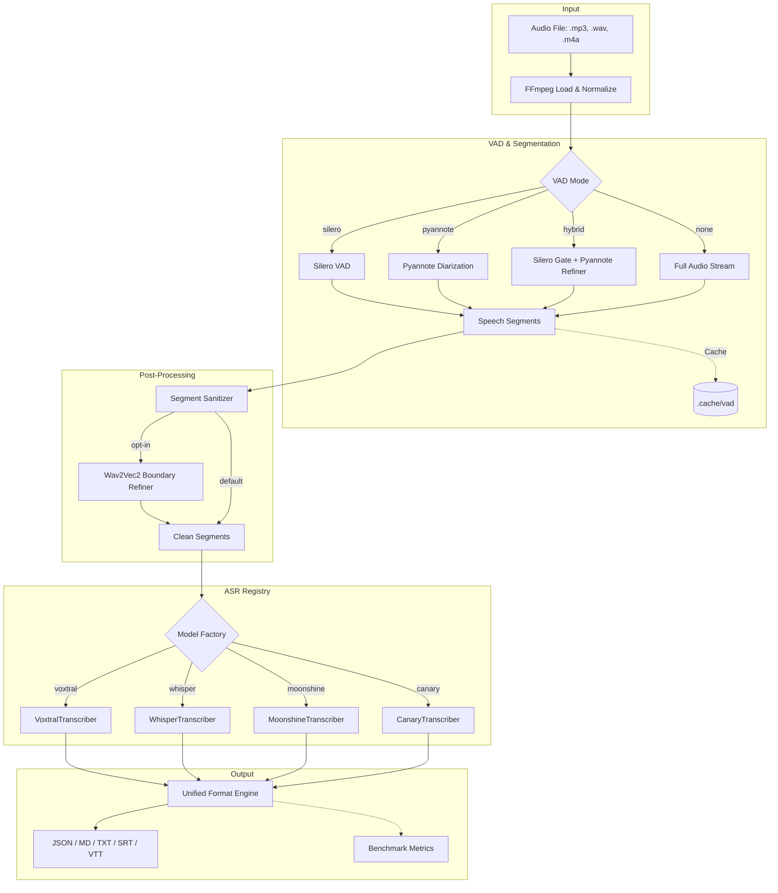

# VoxHub

**Multi-model transcription platform with an OpenAI-compatible API.** Run Voxtral, Whisper, Moonshine, and Canary side-by-side — with advanced VAD, speaker diarization, and optional benchmarking. Optimized for NVIDIA Blackwell (GB10/GX10), CUDA, ROCm, and CPU.

---

## What VoxHub Does

VoxHub is an API-first transcription platform that lets you swap ASR backends without changing your client code. It exposes an OpenAI-compatible `/v1/audio/transcriptions` endpoint, so any client that works with the OpenAI Audio API (OpenHiNotes, TypingMind, etc.) works with VoxHub out of the box.

Under the hood, VoxHub orchestrates multiple transcription engines through a unified pipeline: audio loading, VAD segmentation, model inference, segment merging, and multi-format output — all configurable per request.

---

## Quick Start

### Docker (Recommended)

```bash
# Build the image
docker compose build voxhub-api

# Start the API server on port 8000
docker compose up voxhub-api
```

### Manual

```bash
pip install -r requirements.txt
# Create a .env file with your HF_TOKEN (see .env.example)
python server.py
```

### Test It

```bash
curl -X POST http://localhost:8000/v1/audio/transcriptions \
  -F file=@audio/meeting.mp3 \
  -F model=whisper:turbo \
  -F response_format=verbose_json
```

---

## Supported Models

| Family | Specifier | Backend | Key Strength |
| :--- | :--- | :--- | :--- |
| **Voxtral** | `voxtral:mini-4b`, `voxtral:small-24b` | Transformers | Real-time native support, HQ French/English |
| **Whisper** | `whisper:large-v3`, `whisper:turbo`, `whisper:small` | Transformers | Global benchmark leader, extreme throughput |
| **Moonshine** | `moonshine:base`, `moonshine:tiny` | Transformers | Ultra-low latency, CPU-efficient |
| **Canary** | `canary:1b` | NeMo | SOTA accuracy, multi-task (ASR/translation) |

Models are defined in `models.yaml` and loaded lazily on first request.

---

## VAD & Diarization

VoxHub supports four VAD strategies, selectable per request or via config:

| Mode | Description | Best For |
| :--- | :--- | :--- |
| `silero` | Fast, lightweight Silero VAD | Speed-first workflows |
| `pyannote` | High-accuracy Pyannote segmentation + speaker diarization | Production quality |
| `hybrid` | Silero gate + Pyannote refiner with confidence-based safety net | Best recall + precision |
| `none` | No segmentation — process entire audio as one segment | Pre-segmented audio |

### Hybrid Mode (Refined Gating)

The hybrid pipeline uses Silero as a sensitive gate (threshold `0.35`) to capture all potential speech, then passes the audio to Pyannote for fine-grained segmentation and speaker labeling. A safety-net override keeps high-confidence Silero segments (probability > `0.8`) even if Pyannote disagrees.

```bash
# CLI
python main.py audio/meeting.mp3 --vad hybrid --diarize

# Tune the thresholds
python main.py audio/meeting.mp3 --vad hybrid --silero-threshold 0.3 --override-threshold 0.85
```

### Segment Post-Processing

After diarization, segments go through two optional post-processing layers before transcription. This fixes the common issue where Pyannote splits a speaker's turn at a short interjection (e.g. "ok", "yeah", "better"), producing mis-aligned timestamps.

**Layer 1 — Segment Sanitizer** (on by default)

Rule-based, no ML overhead. Handles two issues:

1. **Micro-turn absorption**: When speaker A is interrupted by a very short speaker B turn (< `--min-turn` seconds) and speaker A resumes immediately after, the two A segments are merged into one continuous turn. The interjection is dropped — its audio falls within the merged range and is captured by the ASR model.
2. **Overlap resolution**: When two segments overlap in time, the shorter one is trimmed so the timeline is strictly sequential.

```bash
# Default: absorb turns shorter than 1.5s
python main.py audio/meeting.mp3 --vad pyannote --diarize

# More aggressive: absorb turns shorter than 2.5s
python main.py audio/meeting.mp3 --vad pyannote --diarize --min-turn 2.5

# Disable sanitization entirely
python main.py audio/meeting.mp3 --vad pyannote --diarize --no-sanitize
```

**Layer 2 — Wav2Vec2 Boundary Refinement** (opt-in via `--refine-boundaries`)

Uses wav2vec2's CTC frame-level probabilities to snap each segment boundary to the exact speech onset/offset. For each boundary, a ±1s audio window is analyzed to find where speech actually starts and ends at the frame level. Useful when Pyannote's boundary is off by a few hundred milliseconds — enough to clip the first or last word.

```bash
python main.py audio/meeting.mp3 --vad hybrid --diarize --refine-boundaries
```

---

## API Reference

### Transcription (Synchronous)

`POST /v1/audio/transcriptions` — OpenAI-compatible. Supports `json`, `verbose_json`, `text`, `srt`, `vtt` formats.

### Transcription (Async Jobs)

For long audio files, use the Jobs API:

1. `POST /v1/audio/transcriptions/jobs` — Submit a job. Returns `job_id` and status/result links.
2. `GET /v1/audio/transcriptions/jobs/{job_id}` — Poll status. Returns `status` (`pending`, `processing`, `completed`, `failed`), `stage` (`loading`, `vad`, `transcribing`, or `null` when done), and `progress` (0-100%).
3. `GET /v1/audio/transcriptions/jobs/{job_id}/result` — Get the full result once completed.

```bash
python test_jobs.py audio/your_audio_file.mp3
```

### Model Management

- `GET /v1/models` — List available models (OpenAI format)
- `GET /models/list` — List currently loaded models (in VRAM)
- `POST /models/load` — Pre-load a model
- `POST /models/unload` — Free VRAM

---

## Configuration

### Environment Variables (.env)

| Variable | Default | Description |
| :--- | :--- | :--- |
| `VOXHUB_MODEL` | `whisper:turbo` | Default transcription model |
| `VOXHUB_VAD` | `pyannote` | VAD mode: `silero`, `pyannote`, `hybrid`, `none` |
| `VOXHUB_DIARIZE` | `true` | Enable speaker diarization |
| `VOXHUB_SILERO_THRESHOLD` | `0.35` | Silero gate sensitivity (hybrid mode) |
| `VOXHUB_OVERRIDE_THRESHOLD` | `0.8` | Confidence override cutoff (hybrid mode) |
| `VOXHUB_MIN_TURN_DURATION` | `1.5` | Speaker turns shorter than this (seconds) are absorbed |
| `VOXHUB_REFINE_BOUNDARIES` | `false` | Enable wav2vec2 boundary snapping |
| `VOXHUB_API_KEY` | — | Optional API authentication |
| `VOXHUB_DEVICE` | `auto` | Hardware: `auto`, `cuda`, `rocm`, `cpu` |
| `HF_TOKEN` | — | Required for Pyannote/hybrid VAD and gated models |

> **Tip — Language Detection**: Whisper models auto-detect the spoken language by default. If you're getting translated output (e.g., English text for French audio), set the `language` parameter explicitly in your request.

### CLI Flags

```bash
python main.py audio.mp3 \
  --model whisper:turbo,voxtral:mini-4b \
  --vad hybrid \
  --diarize \
  --silero-threshold 0.35 \
  --override-threshold 0.8 \
  --min-turn 1.5 \
  --refine-boundaries \
  --precision fp16 \
  --benchmark
```

---

## Benchmarking

Benchmarking is available as an optional mode for profiling model performance.

```bash
# Benchmark specific models
python main.py audio/test.mp3 --model voxtral:mini-4b,whisper:turbo --benchmark

# Benchmark all registered models
python main.py audio/test.mp3 --model all --benchmark
```

When `--benchmark` is enabled, performance metrics are saved to `outputs/benchmarks.json`: RTF (Real-Time Factor), peak VRAM usage, and latency breakdown (model loading vs. VAD vs. transcription).

---

## Architecture



---

## Project Structure

```
api/                  FastAPI server, routers, formatters
  routers/            Endpoint handlers (transcriptions, models, health)
  config.py           Server configuration (Pydantic Settings)
  transcriber.py      Async transcription service with job management
core/
  vad.py              Unified VAD orchestrator (Silero, Pyannote, Hybrid)
  segments.py         Segment post-processor (sanitizer + wav2vec2 boundary refiner)
  diarize.py          Pyannote speaker diarization
  registry.py         Model factory and YAML-based registry
  transcribe*.py      Engine-specific ASR backends
  audio.py            Audio loading (FFmpeg + soundfile)
  cache.py            Persistent VAD segment caching
  benchmark.py        Performance analytics engine
  format.py           Output formatters (JSON, MD, TXT, SRT)
models.yaml           Model registry configuration
server.py             FastAPI app factory + uvicorn entry point
main.py               CLI entry point
docker-compose.yaml   Docker services (Spark, ROCm, CPU, API)
```
