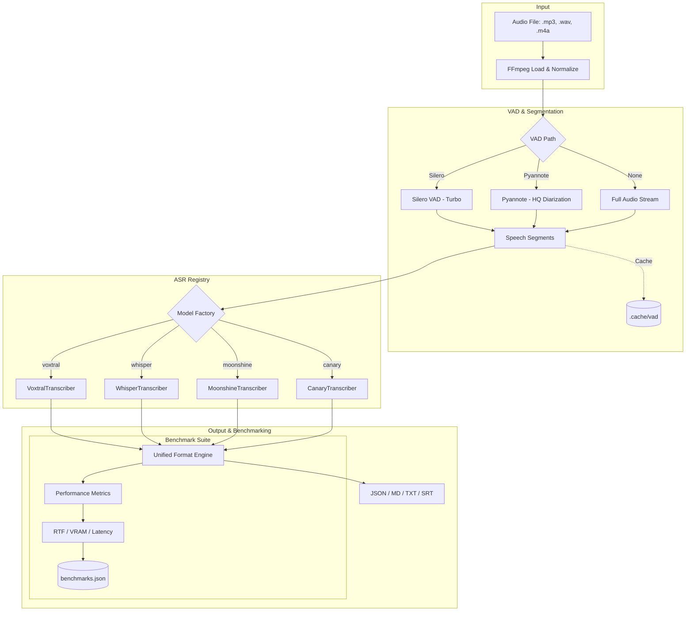

# 🎙️ VoxBench - Multi-Transcribe Explorer

**VoxBench** is a high-performance, unified transcription and benchmarking platform designed to explore and compare state-of-the-art ASR (Automatic Speech Recognition) models. It is optimized for **NVIDIA Blackwell (GB10/GX10)**, CUDA, ROCm, and CPU.

---

## 🎯 Aim of the Project

The primary goal of **Multi-Transcribe** is to provide a standardized environment for evaluating speech-to-text engines. Instead of being locked into a single model, this tool allows researchers and developers to:

1.  **Explore Multi-Model Synergy**: Compare outputs from **Voxtral (Mistral)**, **Whisper (OpenAI)**, **Moonshine**, and **Canary (NVIDIA)** side-by-side.
2.  **Optimize VAD Strategies**: Benchmark lightweight **Silero VAD** against high-accuracy **Pyannote Diarization** to find the perfect speed-to-accuracy balance.
3.  **Performance Profiling**: Use the built-in **Benchmark Mode** to measure **Real-Time Factor (RTF)**, VRAM footprint, and processing latency on elite hardware like the **Asus Ascent GX10**.
4.  **Production-Ready Baseline**: Provide a robust, "Super-Dockerfile" environment that handles complex dependencies (NeMo, Transformers, faster-whisper) out of the box.

---

## 🏗️ Architecture

The project follows a modular, plugin-based architecture where every transcription engine and VAD provider is decoupled via a unified interface.



---

## 🚀 Getting Started (Docker)

### 1. Build the Unified Image
Optimized for **NVIDIA Blackwell (Spark/GX10)** using `uv` for 10x faster builds:
```bash
docker compose build multi-transcribe-spark
```

### 2. Run Transcription
```bash
# Basic transcription (Voxtral + Silero)
docker compose run --rm multi-transcribe-spark /data/audio.mp3

# High-Quality Diarization (Mistral + Pyannote)
docker compose run --rm multi-transcribe-spark /data/meeting.mp3 --vad pyannote --diarize
```

---

## 🔥 Running Benchmarks

### Benchmark Specific Models
You can pass a comma-separated list of models to benchmark them sequentially:
```bash
docker compose run --rm multi-transcribe-spark /data/test.mp3 --model voxtral:mini-4b,whisper:turbo --benchmark
```

### Benchmark EVERYTHING
Use the `all` keyword to iterate through every model in the registry:
```bash
docker compose run --rm multi-transcribe-spark /data/audio.mp3 --model all --benchmark
```

---

## 📊 Supported Models

| Family | Specifier | Backend | Key Strength |
| :--- | :--- | :--- | :--- |
| **Voxtral** | `voxtral:mini-4b`, `voxtral:small-24b` | Transformers | Real-time native support, HQ French/English |
| **Whisper** | `whisper:large-v3`, `whisper:turbo` | faster-whisper | Global benchmark, extreme throughput |
| **Moonshine**| `moonshine:base`, `moonshine:tiny` | Transformers | Ultra-low latency, CPU-efficient |
| **Canary** | `canary:1b` | NeMo | SOTA Accuracy, Multi-task (ASR/AST) |

---

## ⏱️ Benchmark Mode

When `--benchmark` is enabled, the tool logs performance metrics to `outputs/benchmarks.json`.
- **RTF (Real-Time Factor)**: Audio Duration / Processing Time (e.g., `25.0x` means 1 minute of audio is processed in 2.4 seconds).
- **Peak VRAM**: Maximum GPU memory utilized (critical for the 128GB Blackwell unified memory pool).
- **Latency Breakdown**: Time spent on Model Loading vs. VAD vs. Transcription.

---

## 🛠️ Configuration
- `--vad silero`: Fast, lightweight VAD (baseline).
- `--vad pyannote`: High-accuracy segmentation & Diarization.
- `--no-cache`: Disables the VAD segment cache (useful for debugging).
- `--precision [fp16, fp8, q4, q8]`: Quantization options for Voxtral models.

---


---

## 🌐 OpenAI-Compatible API

VoxBench now includes a FastAPI server that provides an OpenAI-compatible transcription endpoint. This allows you to use VoxBench as a drop-in replacement for any client that supports the OpenAI Audio API (e.g., OpenHiNotes, typingmind, etc.).

### ⚙️ Features
- **Drop-in Replace**: Works with official OpenAI SDKs (`/v1/audio/transcriptions`).
- **High Performance**: Optimized for GPU inference with Whisper Turbo and Voxtral.
- **Advanced VAD**: Uses Pyannote for high-accuracy speaker diarization by default.
- **Flexible Formats**: Supports `json`, `verbose_json`, `text`, `srt`, and `vtt`.

### 🚀 Running the API Server

#### Docker Compose (Recommended)
```bash
# Start the API server on port 8000
docker compose up voxbench-api
```

#### Manual Start
1. Ensure dependencies are installed: `pip install -r requirements.txt`
2. Create a `.env` file with your `HF_TOKEN` (see `.env.example`).
3. Run the server:
```bash
python server.py
```

### 🛠️ Configuration (.env)
You can configure the server using a `.env` file or environment variables:
- `VOXBENCH_MODEL`: Default model (e.g., `whisper:turbo`).
- `VOXBENCH_VAD`: VAD mode (`pyannote`, `silero`, or `none`).
- `VOXBENCH_DIARIZE`: Enable/disable diarization (`true`/`false`).
- `VOXBENCH_API_KEY`: Set an API key for optional authentication.
- `HF_TOKEN`: Required for Pyannote VAD/Diarization.

> [!TIP]
> **Language Detection**: By default, Whisper models will auto-detect the spoken language. If you're getting translated output (e.g., English text for French audio), ensure the `language` parameter is not set to `en` in the request. You can explicitly set it to `fr` for French.

---

## 🏗️ Asynchronous Jobs API

For long audio files, you can use the **Jobs API** to submit transcription tasks in the background and poll for progress.

### 1. Submit a Job
`POST /v1/audio/transcriptions/jobs`  
Returns a `job_id` and links for status and results.

### 2. Poll Status
`GET /v1/audio/transcriptions/jobs/{job_id}`  
Returns JSON with `status` (`pending`, `processing`, `completed`, `failed`) and `progress` (0-100%).

### 3. Get Result
`GET /v1/audio/transcriptions/jobs/{job_id}/result`  
Returns the full transcription result once the job is `completed`.

### 🧪 Testing Jobs
You can test the entire workflow using the provided script:
```bash
python test_jobs.py audio/your_audio_file.mp3
```

---

## 📂 Project Structure
- `api/`: FastAPI server and routers.
- `core/registry.py`: Model factory and registry.
- `core/vad.py`: Unified VAD wrapper for Silero/Pyannote.
- `core/cache.py`: Persistent VAD segment caching.
- `core/benchmark.py`: Performance analytics engine.
- `core/transcribe_*.py`: Engine-specific backends.
